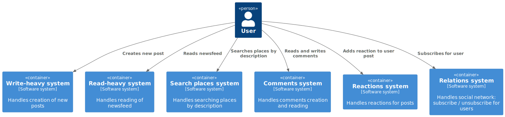
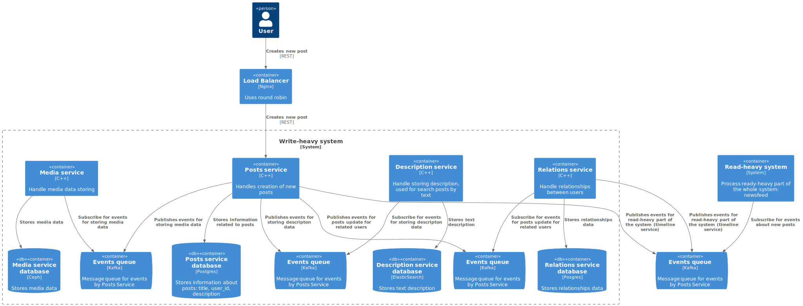
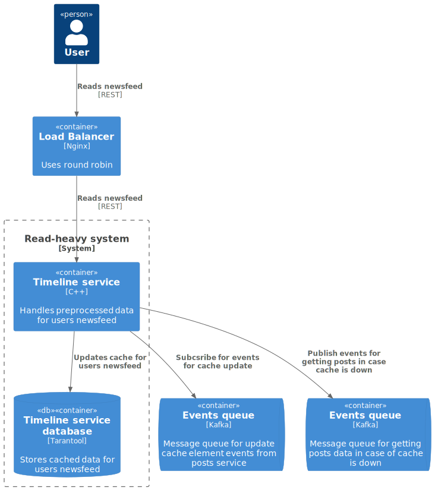

Social Network For Travellers (socNFT)

# Функциональные требования:

- публикация поста с несколькими фотографиями, текстового описания, координат (места)
- оценка и комментарии постов других путешественников
- подписка на других путешественников

- просмотр ленты новостей от тех на кого подписан
- просмотр ленты постов конкретного путешественника

- поиск мест по текстовому описанию

# Нефункциональные требования:

1) Количество пользователей: 10 000 000 DAU
3) Регионы использования приложения: СНГ
4) Возможно, будет сезонность в зимние праздники, майские праздники, пока не расссматриваем это.
5) Данные храним всегда
6) Максимальное количество подписчиков - 700 000 000. Ориентир: Криштиану Роналду (футбол - 601 млн. в инстаграме)
7) Временные ограничения. 
	- Время на публикацию поста - не более 1 секунды
	- Время на открытие ленты новостей друзей - не более 2-3 секунд
	- Время на открытие ленты постов при заходе на страницу к конкретному другу? 1-2 секунды
	- Готовность р-тов выдачи поиска мест по текстовому описанию? 2-3 сек. максимум
8) Сколько по времени приложение может быть недоступно за год? Не более, чем час простоя в год: 99.99%
9) Среднее кол-во фотографий в одном посте - 3 шт.

10) Сколько один пользователь в день будет, в среднем, писать постов: 2 штуки
11) Сколько один пользователь в день будет, в среднем, смотреть постов: 10 штук
12) Сколько один пользователь в день будет, в среднем, оставлять комментариев: 2 штуки
13) Сколько один пользователь в день будет, в среднем, смотреть комментариев: 100 штук
14) Сколько один пользователь в день будет, в среднем, оставлять реакций: 10 штук
15) Сколько один пользователь в день будет, в среднем видеть реакций: 1000 штук

## Design overview

For system design I have used [C4 model](https://c4model.com/). The C4 model was created as a way to help software development teams describe and communicate software architecture, both during up-front design sessions and when retrospectively documenting an existing codebase. It's a way to create maps of your code, at various levels of detail, in the same way you would use something like Google Maps to zoom in and out of an area you are interested in.

     <b>Level 1.</b> System context diagram  

  

     <b>Level 1.</b> System context diagram detailed  

  

     <b>Level 2.</b>Write-heavy system  

  

     <b>Level 2.</b>Read-heavy system  

  

# Performance Analysis:

- posts:

write:
RPS = 10000000 * 2 / 86400 = 250 rps
AvgRequest = 5 Mb (photos size) * 3 (num photos) = 15 Mb
Traffic = 250 rps * 15 Mb = 3 750 Mb = 4 000 Mb = 4Gb/s

read:
RPS = 10000000 * 10 / 86400 = 1200 rps
AvgRequest = 5 Mb (photos size) * 3 (num photos) = 15 Mb
Traffic = 1200 rps * 15 Mb = 18 000 Mb = 18Gb/s

- comments:

write:
RPS = 10000000 * 2 / 86400 = 578 = 250 rps
AvgRequest = 2Kb
Traffic = 250 rps * 2 kb = 500 kb/s

read:
RPS = 10000000 * 100 / 86400 = 11600 rps
AvgRequest = 2Kb
Traffic = 11600 rps * 2 kb = 23200 kb = 24 Mb/s

- reactions

write:
RPS = 10000000 * 10 / 86400 = 1200 rps
AvgRequest = 100b
Traffic = 1200 rps * 100b = 120 000b = 120kb/s

read:
RPS = 10000000 * 1000 / 86400 = 116000 rps
AvgRequest = 100b
Traffic = 116000 rps * 100b = 11 600 000 b = 11 600kb/s = 12 Mb/s

# Number of discs calculation:

Considering the following SSD:

| Capacity, Tb | Throughput, Mb/s | IOPS |
|--------------|------------------|------|
| 100          | 500              | 1000 |

Result table
|                      | posts     |           | comments |        | reactions |         |
|----------------------|-----------|-----------|----------|--------|-----------|---------|
|                      | write     | read      | write    | read   | write     | read    |
| Traffic, Gb/s        | 4         | 18        | 0.0005   | 0.025  | 0.00012   | 0.012   |
| Traffic, Mb/s        | 4000      | 18000     | 0.5      | 25     | 0.12      | 12      |
| Traffic, Kb/s        |           |           | 500      |        | 120       |         |
| Capacity, Gb         | 126144000 | 567648000 | 15768    | 788400 | 3784.32   | 378432  |
| Capacity, Tb         | 126144    | 567648    | 15.768   | 788.4  | 3.78432   | 378.432 |
| Capacity, Pb         | 126.144   | 567.648   |          |        |           |         |
|                      |           |           |          |        |           |         |
| Disks for capacity   | 1261.44   | 5676.48   | 0.15768  | 7.884  | 0.0378432 | 3.78432 |
| Disks for throughput | 8         | 36        | 0.001    | 0.05   | 0.00024   | 0.024   |
| Disks for iops       | 4         | 18        | 0.0005   | 0.025  | 0.00012   | 0.012   |
|                      |           |           |          |        |           |         |
| Result num disks     | 1262      | 5677      | 1        | 8      | 1         | 4       |

Summary: 
1) Posts + Media: ~ 7000 SSD discs
Space is mostly occupied by media data
2) Comments: ~10 SSD discs
3) Reactions: ~5 SSD discs

# Number of hosts calculation:

using the following formula:
Hosts = disks / disks_per_host * replication_factor

*posts*:
disks = 7000
disks_per_host = 2
replication_factor = 2

Hosts = 7000 / 2 * 2 = 7000

*comments*
disks = 10
disks_per_host = 2
replication_factor = 2

Hosts = 10 / 2 * 2 = 10

*reactions*
disks = 5
disks_per_host = 2
replication_factor = 2

Hosts = 5 / 2 * 2 = 5

# sharding:

## Description service:

Sharding by id (description-id)
Async replication

## Relations service:

Sharding by id (user-id)
Async replication

## Posts service:

Sharding by id (post-id)
Async replication

## Timeline service:

Sharding by id (user-id)
Async replication

## Media service:

Sharding by id (photo-id)
Async replication

## Reactions service:

Sharding by post-id
Async replication

## Comments service:

Sharding by post-id
Async replication